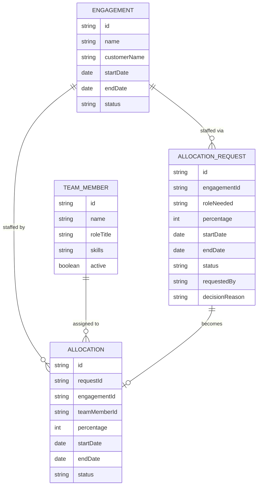

# Domain Model

The allocation system tracks customer engagements, the team member roster, requests to staff an engagement, and the confirmed allocations those requests become.

An `ENGAGEMENT` accumulates `ALLOCATION_REQUEST`s as an Engagement Manager asks for staff. A Resource Manager approves a request, naming a `TEAM_MEMBER`, and the request becomes an `ALLOCATION` — the confirmed record both the Team Member and the Engagement Manager see. Utilization for a team member is the sum of `percentage` across their active/upcoming `ALLOCATION`s.