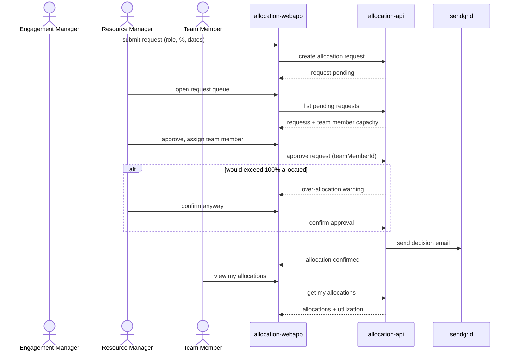

# Allocation Request &amp; Approval

An Engagement Manager requests a team member for an engagement; a Resource Manager reviews capacity, approves and assigns a team member (or rejects), both sides get notified by email, and the Team Member sees the resulting allocation.

